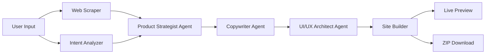

<p align="center">
  
  
  
  
  
</p>

<h1 align="center">🎨 Joshi's AI Studio</h1>

<p align="center">
  <strong>An autonomous multi-agent AI system that generates stunning, production-ready landing pages in under 90 seconds.</strong>
</p>

<p align="center">
  Enter any website URL, brand name, or custom product description — and watch four specialized AI agents collaborate to deliver a fully responsive, self-contained HTML5 landing page with premium UI/UX design.
</p>

---

## 📋 Table of Contents

- [Problem Statement](#-problem-statement)
- [Solution](#-solution)
- [Key Features](#-key-features)
- [Codebase Architecture](#-codebase-architecture)
- [Technology Stack & Rationale](#-technology-stack--rationale)
- [Differentiator Matrix](#-differentiator-matrix)
- [UI/UX Design Integrity](#-uiux-design-integrity)
- [Setup & Installation Guide](#-setup--installation-guide)
- [Usage](#-usage)
- [Strategic Product Roadmap](#-strategic-product-roadmap)
- [Security & Compliance](#-security--compliance)
- [License](#-license)

---

## 🎯 Problem Statement

Building high-quality landing pages today is **expensive, slow, and fragmented**:

| Pain Point | Impact |
|:---|:---|
| **Design Bottleneck** | Hiring a designer + developer costs $2,000–$15,000+ per page |
| **Time-to-Market** | Traditional agencies take 2–6 weeks for a single landing page |
| **Template Limitations** | Drag-and-drop builders produce generic, cookie-cutter designs lacking brand identity |
| **Technical Debt** | No-code tools generate bloated code with poor SEO and accessibility |
| **Device Fragmentation** | Most generators ignore tablet/mobile-first optimization |

> **The core problem:** There is no tool that can intelligently analyze a brand, understand its positioning, and autonomously generate a production-grade, device-optimized landing page — all in one pipeline.

---

## 💡 Solution

**Joshi's AI Studio** solves this with a **4-agent AI pipeline** that mirrors a real creative agency:

```
┌─────────────────────────────────────────────────────────────────┐
│                    USER INPUT                                    │
│  (Website URL / Brand Name / Custom Product Description)        │
└──────────────────────┬──────────────────────────────────────────┘
                       │
            ┌──────────▼──────────┐
            │   🔍 Web Scraper    │  ← Extracts titles, meta, headings,
            │   & Intent Analyzer │    paragraphs, images, features
            └──────────┬──────────┘
                       │
            ┌──────────▼──────────┐
            │  🧠 Agent 1:        │  ← Synthesizes brand positioning,
            │  Product Strategist │    color palette, target audience
            └──────────┬──────────┘
                       │
            ┌──────────▼──────────┐
            │  ✍️ Agent 2:        │  ← Generates hero, features, pricing,
            │  Conversion         │    testimonials, FAQ copy
            │  Copywriter         │
            └──────────┬──────────┘
                       │
            ┌──────────▼──────────┐
            │  🎨 Agent 3:        │  ← Produces self-contained HTML5 +
            │  UI/UX Architect    │    CSS3 + JS with premium design
            └──────────┬──────────┘
                       │
            ┌──────────▼──────────┐
            │  📁 Site Builder    │  ← Saves output, serves preview,
            │  & Export Engine    │    generates downloadable ZIP
            └─────────────────────┘
```

**Result:** From input to production-ready landing page in **30–90 seconds**.

---

## 🌟 Key Features

### Core Capabilities
- **🌐 Intelligent Web Scraping** — Extracts and analyzes any website's content, structure, and brand identity
- **🤖 Multi-Agent Architecture** — 4 specialized AI agents (Strategist → Copywriter → Architect → Builder) collaborate in sequence
- **📝 Smart Intent Analysis** — Understands brand names ("Spotify"), custom descriptions ("AI fitness tracker"), and URLs equally well
- **📱 Device-Optimized Output** — Generates layouts specifically tailored for Desktop, Tablet, or Mobile viewports

### Design & Customization
- **🎨 5 Premium Color Themes** — Cream Purple, Cyberpunk Neon, Emerald Tech, Indigo SaaS, Sunset Amber
- **✨ Modern UI/UX** — Glassmorphism, gradient accents, Google Fonts (Outfit/Inter), Lucide icons, micro-animations
- **🔄 Real-time Color Switching** — Change themes after generation without re-running the pipeline
- **📐 Responsive Design** — Every page adapts seamlessly across all screen sizes

### Export & Integration
- **📦 ZIP Download** — Export complete landing page as a downloadable ZIP archive (HTML + metadata + README)
- **👁️ Live Preview** — Interactive iframe preview with fullscreen mode
- **🔌 Multi-LLM Support** — OpenAI GPT-4o, Google Gemini, Anthropic Claude, and local Ollama models
- **📜 History Tracking** — Browse and revisit all previously generated landing pages

### Security
- **🔐 Zero-Persistence API Keys** — Keys processed in-memory only, never written to disk
- **🛡️ Path Traversal Protection** — Strict directory boundary enforcement
- **🔒 HTTP Security Headers** — XSS, clickjacking, and MIME-sniffing protection
- **👑 Admin-Only Model Access** — Locked configuration prevents unauthorized modifications

---

## 🏗️ Codebase Architecture

```
joshis-ai-studio/
├── app.py                 # Flask web server, API endpoints, and embedded UI
├── generator.py           # Pipeline orchestrator (coordinates all agents)
├── agents.py              # AI Agent definitions (Strategist, Copywriter, Architect)
├── llm.py                 # Unified LLM client (OpenAI, Gemini, Anthropic, Ollama)
├── scraper.py             # Web scraper & HTML parser (BeautifulSoup)
├── builder.py             # Site builder & file output manager
├── config.py              # Configuration, environment, and security settings
├── main.py                # CLI entry point (generate & preview commands)
├── requirements.txt       # Python package dependencies
├── .env.example           # Environment variables template (safe to commit)
├── .gitignore             # Git exclusion rules
├── LICENSE                # MIT License
├── SECURITY.md            # Security policy & vulnerability reporting
├── CONTRIBUTING.md        # Contribution guidelines
└── output/                # Generated landing pages (git-ignored)
    └── <domain_slug>/
        ├── index.html     # Generated landing page
        └── metadata.json  # Strategy + copy data
```

### Module Responsibility Map

| Module | Responsibility | Lines | Key Classes/Functions |
|:---|:---|:---:|:---|
| `app.py` | Web server, REST API, embedded frontend UI | 610 | `generate()`, `download_zip()`, `add_security_headers()` |
| `generator.py` | Orchestrates the 4-stage agent pipeline | 99 | `LandingPageGenerator.generate_from_url()` |
| `agents.py` | Defines AI agent roles, prompts, and JSON parsing | 200 | `ProductStrategistAgent`, `CopywriterAgent`, `UIArchitectAgent` |
| `llm.py` | Abstracts LLM API calls + smart fallback engine | 596 | `LLMClient.generate()`, `_fallback_generate()` |
| `scraper.py` | Scrapes websites and builds exact page clones | 167 | `WebScraper.scrape_url()`, `_build_exact_page_clone()` |
| `builder.py` | Saves HTML/metadata to disk and serves preview | 52 | `SiteBuilder.save_landing_page()` |
| `config.py` | Loads env vars, validates providers, admin locks | 38 | `Config.get_api_key()`, `Config.sanitize_provider()` |

### Data Flow Diagram



---

## ⚙️ Technology Stack & Rationale

| Technology | Version | Purpose | Why This Choice |
|:---|:---:|:---|:---|
| **Python** | 3.10+ | Core runtime | Industry standard for AI/ML, rich ecosystem |
| **Flask** | 3.0+ | Web framework | Lightweight, minimal overhead, perfect for API-first apps |
| **Flask-CORS** | 4.0+ | Cross-origin support | Enables flexible frontend deployment |
| **BeautifulSoup4** | 4.12+ | HTML parsing & scraping | Most reliable Python HTML parser, handles malformed HTML |
| **OpenAI SDK** | 1.12+ | GPT-4o / GPT-4o-mini | Best-in-class reasoning for code generation |
| **Requests** | 2.31+ | HTTP client | Standard library for API calls and web scraping |
| **python-dotenv** | 1.0+ | Environment management | Secure .env file loading without hardcoding secrets |
| **Pydantic** | 2.6+ | Data validation | Type-safe configuration and schema enforcement |
| **Rich** | 13.7+ | Terminal UI | Beautiful CLI progress output and debugging |
| **Jinja2** | 3.1+ | Template engine | Flexible HTML templating (Flask dependency) |
| **HTML5 + CSS3 + JS** | Latest | Generated output | Self-contained, zero-dependency landing pages |
| **Google Fonts** | CDN | Typography | Premium Outfit/Inter fonts for professional look |
| **Lucide Icons** | CDN | Iconography | Modern, consistent SVG icon library |

---

## 🏆 Differentiator Matrix

| Feature | Joshi's AI Studio | Wix ADI | Framer AI | v0 by Vercel | Mixo.io |
|:---|:---:|:---:|:---:|:---:|:---:|
| **Multi-Agent Pipeline** | ✅ 4 agents | ❌ | ❌ | ❌ | ❌ |
| **URL-to-Landing Page** | ✅ | ❌ | ❌ | ❌ | ✅ |
| **Brand Intent Analysis** | ✅ | ❌ | ⚠️ Partial | ❌ | ❌ |
| **Custom Prompt Support** | ✅ | ❌ | ✅ | ✅ | ✅ |
| **Device-Specific Optimization** | ✅ Desktop/Tablet/Mobile | ⚠️ Auto | ⚠️ Auto | ❌ | ❌ |
| **5 Premium Color Themes** | ✅ | ❌ | ❌ | ❌ | ❌ |
| **Multi-LLM Provider Support** | ✅ 4 providers | ❌ | ❌ | ❌ | ❌ |
| **Self-Contained HTML Output** | ✅ | ❌ Locked | ❌ Locked | ✅ | ❌ |
| **ZIP Download Export** | ✅ | ❌ | ❌ | ✅ | ❌ |
| **Open Source** | ✅ MIT | ❌ | ❌ | ❌ | ❌ |
| **Local LLM Support (Ollama)** | ✅ | ❌ | ❌ | ❌ | ❌ |
| **Zero API Key Persistence** | ✅ | N/A | N/A | N/A | N/A |
| **Price** | Free | $17/mo+ | $20/mo+ | $20/mo+ | $9/mo+ |

---

## 🎨 UI/UX Design Integrity

### Design Philosophy

Joshi's AI Studio follows a **dark-first, glassmorphic design system** inspired by premium SaaS tools:

- **Dark Mode Foundation** — Deep backgrounds (#0a0a0f) with subtle gradients reduce eye strain and create a premium feel
- **Glassmorphism Cards** — `backdrop-filter: blur()` with semi-transparent borders for modern depth
- **Accent Color System** — HSL-based primary/secondary colors propagated via CSS custom properties
- **Micro-Animations** — Smooth transitions on hover states, loading spinners, and step completions
- **Typography Hierarchy** — Google Fonts (Outfit/Inter) with carefully scaled sizes for readability

### Color Theme System

| Theme | Primary | Secondary | Aesthetic |
|:---|:---:|:---:|:---|
| 🟣 Cream Purple | `#6818cd` | `#d4f937` | Elegant luxury with electric accent |
| 🔵 Cyberpunk Neon | `#00f2fe` | `#f000ff` | Futuristic high-energy neon |
| 🟢 Emerald Tech | `#10b981` | `#06b6d4` | Clean, trustworthy fintech aesthetic |
| 🟤 Indigo SaaS | `#6366f1` | `#a855f7` | Professional enterprise software |
| 🟠 Sunset Amber | `#ff5e36` | `#f59e0b` | Warm, energetic startup feel |

### Component Architecture

The web studio UI includes:
- **Control Panel** — Input fields, preset chips, device selector, theme picker, provider selector
- **Agent Stepper** — Real-time 4-step progress visualization
- **Preview Canvas** — Live iframe rendering with fullscreen toggle
- **Export Bar** — Download HTML and ZIP export buttons
- **History Gallery** — Grid of previously generated pages

---

## 🚀 Setup & Installation Guide

### Prerequisites

- **Python 3.10+** — [Download Python](https://www.python.org/downloads/)
- **Git** — [Download Git](https://git-scm.com/)
- **API Key** — At least one: OpenAI, Google Gemini, Anthropic, or Ollama (local)

### Step 1: Clone the Repository

```bash
git clone https://github.com/YOUR_USERNAME/joshis-ai-studio.git
cd joshis-ai-studio
```

### Step 2: Create Virtual Environment

```bash
# Create virtual environment
python -m venv venv

# Activate (Windows)
venv\Scripts\activate

# Activate (macOS/Linux)
source venv/bin/activate
```

### Step 3: Install Dependencies

```bash
pip install -r requirements.txt
```

### Step 4: Configure API Keys

```bash
# Copy the template
cp .env.example .env
```

Edit `.env` with your preferred provider's API key:

```env
# Provide at least one API key
OPENAI_API_KEY=sk-your-key-here
GEMINI_API_KEY=your-gemini-key-here
ANTHROPIC_API_KEY=your-anthropic-key-here

# Default provider
DEFAULT_PROVIDER=openai
DEFAULT_MODEL=gpt-4o-mini
```

> **🔒 Security Note:** The `.env` file is git-ignored and never committed. API keys are processed in-memory only.

### Step 5: Launch the Application

#### Web Studio UI (Recommended)

```bash
python app.py
```

Open **http://localhost:5000** in your browser.

#### CLI Mode

```bash
# Generate from URL
python main.py generate --url https://github.com

# Generate with preview
python main.py generate --url https://stripe.com --preview

# Use specific LLM provider
python main.py generate --url https://notion.so --provider gemini --model gemini-1.5-flash
```

---

## 📖 Usage

### Web Studio

1. **Enter Input** — Type a website URL, brand name, or custom product description
2. **Select Device** — Choose Desktop, Tablet, or Mobile optimization
3. **Pick Theme** — Select from 5 premium color schemes
4. **Choose Provider** — Select your LLM provider (or use BYOK)
5. **Generate** — Click "Generate Landing Page" and watch the 4 agents work
6. **Preview** — View the live preview in the embedded canvas
7. **Export** — Download as HTML or ZIP archive

### Custom Prompt Examples

| Input | What It Generates |
|:---|:---|
| `Spotify` | A Spotify-branded music streaming landing page |
| `https://stripe.com` | A payment platform landing page based on Stripe's actual content |
| `AI fitness tracker with workout logs` | A custom "FitPulse AI" branded fitness app landing page |
| `Dark mode crypto trading dashboard` | A "CryptoBot Pro" styled crypto trading platform page |

---

## 🗺️ Strategic Product Roadmap

### Phase 1 — Foundation ✅ (Current)
- [x] Multi-agent pipeline (Strategist → Copywriter → Architect → Builder)
- [x] Web scraping with exact page clone capability
- [x] Smart intent analysis (URLs, brand names, custom descriptions)
- [x] 5 premium color themes
- [x] Device-specific optimization (Desktop/Tablet/Mobile)
- [x] ZIP download export
- [x] Multi-LLM support (OpenAI, Gemini, Anthropic, Ollama)
- [x] Security hardening (headers, path guards, input sanitization)

### Phase 2 — Enhanced Generation (Q1 2027)
- [ ] Real-time streaming generation with SSE (Server-Sent Events)
- [ ] Custom font selection (10+ Google Font families)
- [ ] AI-generated hero images via DALL-E / Stable Diffusion integration
- [ ] Multi-page generation (Home + About + Contact + Blog)
- [ ] Section-level drag-and-drop reordering

### Phase 3 — Collaboration & Deployment (Q2 2027)
- [ ] User authentication and project management dashboard
- [ ] Team collaboration with shared workspaces
- [ ] One-click deployment to Vercel / Netlify / GitHub Pages
- [ ] Custom domain mapping
- [ ] Version history with diff comparison

### Phase 4 — Enterprise & Scale (Q3 2027)
- [ ] White-label branding for agencies
- [ ] API-first mode for programmatic generation
- [ ] Batch generation (bulk URLs/prompts)
- [ ] A/B testing integration
- [ ] Analytics dashboard with conversion tracking
- [ ] WordPress / Shopify plugin export

### Phase 5 — Intelligence (Q4 2027)
- [ ] Competitor analysis and positioning recommendations
- [ ] SEO score optimization with real-time suggestions
- [ ] Accessibility audit (WCAG 2.1 AA compliance)
- [ ] Performance optimization (Core Web Vitals targeting)
- [ ] Multi-language landing page generation

---

## 🔐 Security & Compliance

### Security Architecture

| Layer | Protection | Implementation |
|:---|:---|:---|
| **API Keys** | Zero-persistence | In-memory only, loaded from `.env`, never in responses |
| **Input Validation** | Regex sanitization | `re.sub(r"[^\w-]", "", ...)` on all user-provided slugs |
| **Path Traversal** | Directory boundary | `Path.is_relative_to(OUTPUT_DIR)` enforcement |
| **HTTP Headers** | XSS / Clickjacking / MIME | `X-XSS-Protection`, `X-Frame-Options`, `X-Content-Type-Options` |
| **Provider Validation** | Allowlist | `Config.ALLOWED_PROVIDERS` whitelist |
| **Admin Control** | Model lock | `Config.ADMIN_LOCK_ENABLED` — only owner modifies pipeline |
| **Permissions** | Feature policy | `Permissions-Policy: geolocation=(), microphone=(), camera=()` |

### Compliance Considerations

- **OWASP Top 10** — Addresses injection (A03), broken access control (A01), security misconfiguration (A05)
- **Data Privacy** — No user data is stored beyond generated HTML files; no cookies, no tracking
- **Dependency Security** — All dependencies are pinned with minimum versions in `requirements.txt`

For detailed security information, see [SECURITY.md](SECURITY.md).

---

## 📜 License

This project is licensed under the **MIT License** — see the [LICENSE](LICENSE) file for details.

---

<p align="center">
  <strong>Built with ❤️ by Joshi</strong>
  <br/>
  <em>Powered by AI Agents • Secured by Design • Open Source</em>
</p>
